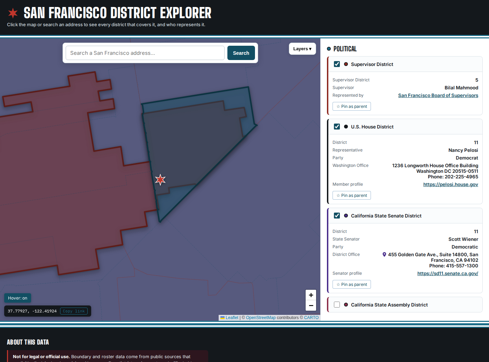

<!-- ==== GENERATED:BEGIN metro-header ==== -->
# San Francisco District Explorer

**Click any point in San Francisco — or search an address — and see every civic district that contains it, and who represents you there.**
<!-- ==== GENERATED:END metro-header ==== -->

A single-file, dependency-light web app: one `index.html`, Leaflet for the map, no build step, no framework, no server-side code. Deployed as a static site — any static host or server works.



## What it answers

Pick a point. The app runs a point-in-district lookup across every layer you have toggled on and builds a "civic profile" for that location:

| Group | Layer | What you get |
|---|---|---|
| **Political** | City Ward | Ward number, alderman, office phone + address |
| | Ward Precinct | Precinct number (a sub-selection of City Ward — turning it on drops the ward to an outline and fills it with its precincts) |
| | Cook County Commissioner District | District number, commissioner, office address |
| | U.S. House District | District (IL-N), representative, party, D.C. phone, website |
| | IL State Senate District | Senator, party, Springfield + district offices, ILGA page |
| | IL State House District | State representative, party, offices, ILGA page |
| | Elected School Board District | ERSB district + "6b"-style sub-district, elected board member |
| | IL Supreme Court District | District under PA 102-0011 (District 1 = Cook County) |
| | Cook County Board of Review District | District under PA 102-0012 (property-tax appeals) |
| **Public Safety** | Police District | CPD district number and name, commander, CAPS unit phone/email, station address + phone, district map link |
| | Police Beat | Beat number (a sub-selection of Police District — turning it on drops the district to an outline and fills it with its beats) |
| | CCPSA District Council | The three elected District Councilors for that police district (name + role — Chair / Nominating Committee / Community Engagement) and links to each Councilor's profile + the council page |
| | Police Station (nearest 3) | Station name, address, phone, straight-line distance |
| | Fire Station (nearest 3) | Firehouse + engine designation, distance |
| **Schools** | Elementary / Middle / High School Zone | CPS attendance-boundary school, grades, address, profile link, map pin |
| | CPS Network (K-8 / High School) | Network, chief, phone, office address |
| **Geography** | Community Area | Official community area name + number |
| | ZIP Code | ZIP code |

Every result card is independent: a layer whose data source is down shows an error with a Retry button in that card and never affects the others.

### Shareable links

The URL hash mirrors your current view (`#point=41.88250,-87.62850&layers=ward,school-board`). Copy it from the URL bar — or use the **Copy link** button on the selected-point chip — and anyone opening the link sees the same point with the same layers on.

## Running it

There is nothing to build.

```bash
# any static server works:
python3 -m http.server 8000
# then open http://localhost:8000/
```

Most layers fetch live data from public APIs at runtime, so they need an internet connection. Three layers — Elected School Board, IL Supreme Court, and Board of Review — have no public API, so their boundaries ship as same-origin files under `data/app/` that the page fetches on first toggle. With the service worker installed those boundary files are cached (cache-first), so once a layer has loaded it keeps working offline; the officeholder rosters are cached network-first so a returning visitor always gets the latest.

## Architecture

Stable core + pluggable layer modules, all inside `index.html`. The full contract and build history live in [`docs/BUILD_PLAYBOOK_1.md`](docs/BUILD_PLAYBOOK_1.md).

- **Core**: Leaflet map, click-to-select + Nominatim geocoder (debounced, Chicago-bounded), global `{selectedPoint, sequence}` state where a monotonic sequence counter discards stale async results, shared `sanitize` / `pointInGeometry` / `fetchJSONWithRetry` utilities, layer registry + result-card framework with per-layer failure isolation, selected-boundary highlight, URL-hash permalinks.
- **Modules**: each layer registers `{id, group, label, overlay:{load, style}, query(point, seq), render(result)}`. Overlays lazy-load on first toggle and are cached; `query` runs a local point-in-polygon test against the cached boundaries (or nearest-N haversine for station layers).
- **Honesty rules**: external strings are sanitized or rendered via `textContent`; officeholder data is never guessed — where no verifiable roster source exists, cards link to the official body instead.

### Data sources

| Source | Used for |
|---|---|
| [Chicago Data Portal](https://data.cityofchicago.org) (Socrata) | Wards + aldermen roster, ward precincts, fire stations, CPS zones + networks, community areas, ZIP codes |
| CPD ArcGIS (`services2.arcgis.com/t3tlzCPfmaQzSWAk`) | Police district boundaries, police beat boundaries, police station roster |
| [chicagopolice.org](https://www.chicagopolice.org) per-district pages (scraped weekly by CI) | Police district commander, CAPS unit phone/email, station address (`data/app/cpd-district-info.json`) |
| [ccpsa.chicago.gov](https://ccpsa.chicago.gov) per-council pages (scraped weekly by CI) | CCPSA District Council elected Councilors — name + role per police district (`data/app/ccpsa-district-councils.json`); boundaries reuse the CPD police-district geometry |
| Cook County GIS (`gis.cookcountyil.gov/traditional/rest/services/politicalBoundary`) | Cook County Commissioner District boundaries + office roster |
| [U.S. Census TIGERweb](https://tigerweb.geo.census.gov) | Congressional, IL Senate, IL House boundaries |
| [unitedstates/congress-legislators](https://github.com/unitedstates/congress-legislators) (rebuilt weekly by CI) | U.S. House roster — IL's 17 reps only, `data/app/congress-roster.json` |
| [ilga.gov](https://www.ilga.gov) (scraped weekly by CI) | IL Senate/House member rosters (`data/app/il-{senate,house}-members.json`) |
| ERSB shapefile (`ERSB_20_Sub_District_Map_FA1_SB_15`) | Elected School Board sub-districts (`data/app/school-board-*.json`) |
| PA 102-0011 / PA 102-0012 shapefiles | IL Supreme Court + Cook County Board of Review districts (`data/app/*.json`) |
| [Nominatim / OpenStreetMap](https://www.openstreetmap.org/copyright) | Address search + school-address pins |

The app-data boundary layers in `data/app/` are topology-preserving simplifications (mapshaper) of the official shapefiles; the full-precision GeoJSON conversions are kept in `data/` and the untouched originals in `data/source/raw/`. The simplified copies agreed with full precision on 100% of 2,000 random in-city test points.

## Repository layout

```
index.html                  the entire app (styles, core, all layer modules)
data/app/                   app-data files the page fetches (boundary geometry + officeholder rosters)
data/                       full-precision GeoJSON reference conversions
data/source/                intermediate conversions
data/source/raw/            original shapefiles / KML / KMZ / XLSX as supplied
scripts/ilga_scraper.py     scrapes ilga.gov member rosters
scripts/build_il_roster.py  writes data/app/il-{senate,house}-members.json from scraper output
scripts/build_congress_roster.py  writes data/app/congress-roster.json (IL U.S. House reps) from congress-legislators
scripts/cpd_district_scraper.py  scrapes chicagopolice.org per-district commander/contact pages (real-browser fallback for Cloudflare)
scripts/build_cpd_roster.py      writes data/app/cpd-district-info.json from scraper output
scripts/ccpsa_scraper.py         scrapes ccpsa.chicago.gov per-council pages for the elected District Councilors
scripts/build_ccpsa_roster.py    writes data/app/ccpsa-district-councils.json from scraper output
scripts/requirements.txt    pinned scraper deps (requests, beautifulsoup4, playwright)
scripts/build_embedded_boundaries.py  simplifies data/*.geojson into data/app/*.json (occasional operator step)
scripts/validate_index.py   post-regeneration gate: app parses, all data/app files present + well formed
scripts/smoke_test.mjs      Playwright boot/behaviour smoke test (runs on every PR)
.github/workflows/          weekly roster refreshes (PR for human review) + per-PR smoke test
docs/BUILD_PLAYBOOK_1.md    architecture contract + per-thread build/status log
docs/OPTIMIZATION_PLAYBOOK.md  optimization & refinement playbook (measured findings + prioritized tasks)
docs/screenshot.png         README screenshot
```

## Validation

Two gates run in CI:

- **Static gate** (`scripts/validate_index.py`, wired into the weekly roster workflows between regeneration and the PR): the inline script passes `node --check`, every layer is still registered, no dataset is embedded inline, and every `data/app/` file is present and complete (20 school-board districts, 59 + 118 IL legislators, 17 U.S. House reps, 5 + 3 court/board districts). A bad data regeneration can't reach `main` unreviewed.
- **Behaviour gate** (`scripts/smoke_test.mjs`, run on every pull request by `.github/workflows/smoke-test.yml`): a real Chromium boot via Playwright asserts the app comes up, registers all 22 layers, classifies a known downtown point with the three no-API layers against known ground truth (school board 12, IL Supreme Court 1, Board of Review 3) including the school-board member-roster join, and degrades to an isolated error card + Retry when a data source fails.

## Not for legal or official use

Boundary and roster data come from public sources that explicitly disclaim legal precision. Always confirm district assignments and officeholders with the relevant government office before relying on them for anything official.
